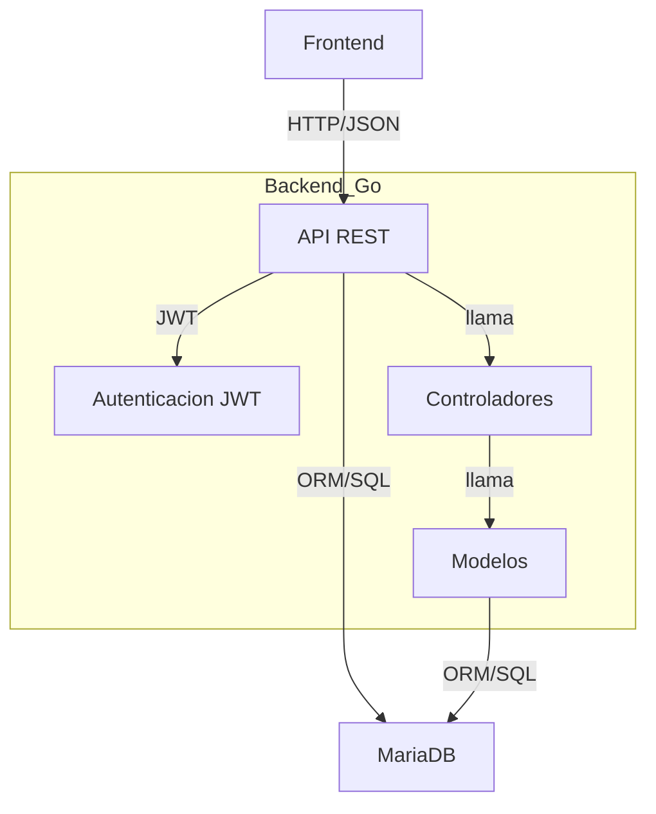

# Backend Gorbac

**Carrito de compras con control de acceso basado en roles (RBAC), desarrollado en Go.**
Incluye autenticación JWT, endpoints RESTful y gestión de usuarios, roles, permisos, productos, órdenes y carrito sobre MariaDB.

> **⚠️ Seguridad:**
> 
> El backend requiere un par de claves RSA para firmar y verificar los tokens JWT:
> - `private.rsa` (clave privada)
> - `public.rsa.pub` (clave pública)
>
> **Estas claves no deben subirse nunca al repositorio.**
>
> ### ¿Cómo generarlas?
> Ejecuta estos comandos en la raíz del proyecto:
> ```bash
> # Generar clave privada (2048 bits)
> openssl genrsa -out private.rsa 2048
> # Extraer la clave pública
> openssl rsa -in private.rsa -pubout -out public.rsa.pub
> ```
>
> Coloca ambos archivos (`private.rsa` y `public.rsa.pub`) en la raíz del proyecto backend (`gorbac/`).
>
> Si una clave privada se filtra, genera una nueva y reemplázala en todos los entornos.

## Arquitectura del Proyecto

El backend de Gorbac está diseñado bajo una arquitectura modular y desacoplada, ideal para sistemas de control de acceso y gestión de recursos. Los principales componentes son:

- **API REST en Go:** Utiliza el framework [chi](https://github.com/go-chi/chi) para el ruteo y middlewares. Expone endpoints RESTful para todas las operaciones principales.
- **Base de datos MariaDB:** Almacena usuarios, roles, productos, permisos, órdenes, etc. El acceso se realiza mediante modelos ORM en Go.
- **Autenticación JWT:** El sistema utiliza JSON Web Tokens para autenticar y autorizar usuarios en los endpoints protegidos.
- **Controladores:** Cada recurso (usuarios, roles, productos, órdenes, carrito, etc.) tiene su propio controlador, encargado de la lógica de negocio y la interacción con los modelos.
- **Modelos:** Representan las entidades de la base de datos y encapsulan la lógica de acceso a datos.
- **Gestión de permisos y roles:** El acceso a los endpoints se controla mediante roles y permisos asociados a los usuarios.
- **Docker Compose:** Orquesta el backend y la base de datos para facilitar el despliegue y desarrollo local.

### Diagrama Simplificado



---

## Levantar el backend con Docker Compose

Este proyecto utiliza Docker Compose para levantar dos servicios principales:

- **api-rbac**: El backend en Go (puerto 8229)
- **database-mariadb**: Base de datos MariaDB (puerto 3306)

### Pasos para levantar el entorno

1. **Clona el repositorio y entra a la carpeta del backend:**
   ```bash
   git clone <repo-url>
   cd gorbac
   ```

2. **Levanta los servicios:**
   ```bash
   docker-compose up --build
   ```
   Esto construirá la imagen del backend y levantará la base de datos con los datos iniciales.

3. **Acceso a los servicios:**
   - API: http://localhost:8229
   - MariaDB: localhost:3306 (usuario: `test`, password: `root123`, base: `gorbac`)

---

## Servicios y Endpoints del Backend

### Autenticación

- `POST /login`  
  Login de usuario (requiere email y password).

- `POST /google-login`  
  Login con Google.

- `GET /refresh`  
  Refresca el token JWT.

- `GET /auth/check`  
  Verifica si el token es válido.

---

### Usuarios

> **Nota:** Los endpoints de usuarios requieren autenticación y permisos de admin.

- `GET /users`  
  Lista todos los usuarios (soporta paginación y búsqueda).

- `GET /users/{id}`  
  Obtiene un usuario por ID.

- `POST /users/add`  
  Crea un nuevo usuario.  
  **Body:**  
  ```json
  {
    "name": "Nombre",
    "email": "email@dominio.com",
    "password": "contraseña",
    "roles": [1,2]
  }
  ```

- `POST /users/edit`  
  Edita un usuario existente.  
  **Body:**  
  ```json
  {
    "ID": 1,
    "name": "Nuevo Nombre",
    "email": "nuevo@email.com",
    "password": "nuevaContraseña",
    "roles": [1]
  }
  ```

- `DELETE /users/delete/{id}`  
  Elimina un usuario por ID.

---

### Roles

- `GET /roles`  
  Lista todos los roles.

- `GET /roles/{id}`  
  Obtiene detalles de un rol.

- `POST /roles/add`  
  Crea un nuevo rol.

- `PUT /roles/{id}/apis`  
  Asocia APIs a un rol.

- `GET /roles/permissions/{id}/apis`  
  Lista las APIs asociadas a un rol.

---

### Productos

- `GET /products`  
  Lista todos los productos.

- `GET /products/{id}`  
  Obtiene detalles de un producto.

- `POST /products/add`  
  Crea un nuevo producto.

- `PUT /products/{id}`  
  Edita un producto.

- `DELETE /products/{id}`  
  Elimina un producto.

---

### Órdenes/Pedidos

- `POST /orders`  
  Crea una nueva orden.

- `GET /orders`  
  Lista todas las órdenes.

- `GET /orders/{id}`  
  Detalles de una orden.

- `GET /orders/user`  
  Órdenes del usuario autenticado.

- `DELETE /orders/{id}`  
  Elimina una orden.

- `PUT /orders/{id}/payment`  
  Actualiza el estado de pago.

- `PUT /orders/{id}/status`  
  Actualiza el estado de la orden.

---

### Carrito

- `GET /cart`  
  Obtiene el carrito del usuario.

- `POST /cart/add`  
  Agrega un producto al carrito.

- `PUT /cart/items/{id}`  
  Modifica la cantidad de un ítem.

- `DELETE /cart/items/{id}`  
  Elimina un ítem del carrito.

- `DELETE /cart`  
  Vacía el carrito.

---

### Categorías

- `GET /categories`  
  Lista todas las categorías.

---

### APIs Management

- `GET /apis`  
  Lista todos los endpoints registrados.

- `POST /apis/add`  
  Agrega un nuevo endpoint API.

- `PUT /apis/{id}`  
  Edita un endpoint API.

- `DELETE /apis/{id}`  
  Elimina un endpoint API.

- `GET /apis/sync`  
  Sincroniza rutas del router con la tabla de APIs (lectura).

- `POST /apis/sync`  
  Agrega endpoints faltantes a la tabla de APIs.

---

## Notas

- Todos los endpoints protegidos requieren autenticación JWT.
- El backend expone un endpoint de health check:  
  `GET /health` → `{"status":"ok"}`
